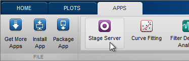
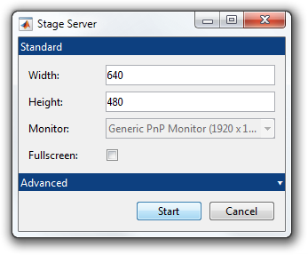
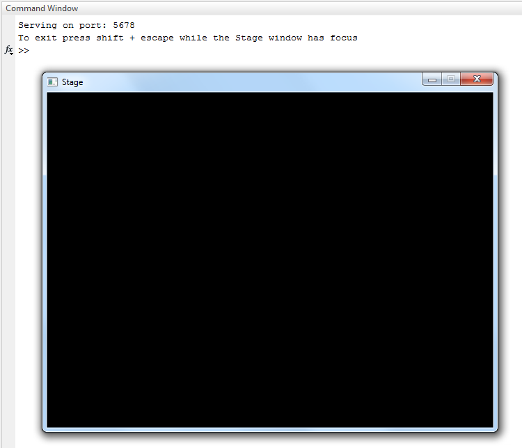
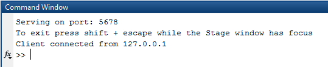

# App Basics

To launch the Stage Server app, click on its icon in the MATLAB Apps tab.



When Stage Server starts you are prompted to initialize settings for the window/canvas to serve.



After pressing **Start** a Stage window/canvas appears.



The MATLAB session is now blocked waiting for client connections.

In a separate MATLAB session on the same computer or another computer, you can now connect to the server by using `StageClient` in the MATLAB command window.

```matlab
>> client = stage.core.network.StageClient();
>> client.connect();
```

<table cellspacing="0" class="note" summary="Note" cellpadding="5" border="1"><tbody><tr width="90%"><td>
<b>Note:</b> If your running from a separate machine must specify the server's IP address when calling <code>connect()</code> (e.g. <code>client.connect('128.95.10.27')</code>)
</td></tr></tbody></table>

When a client connects to the server, the MATLAB session running the Server displays "Client connection from ..." in its command window.



Only one client may be connected to a Stage Server at any time.

You can now play presentations prepared in the client session on the Stage window/canvas in the server instance by calling the client `play()` method.

```matlab
>> p = stage.core.Presentation(5);
>> p.addStimulus(stage.builtin.stimuli.Rectangle());
>> player = stage.builtin.players.RealtimePlayer(p);
>> client.play(player);
```

When you're done using the remote canvas, you can disconnect from the server by deleting the client object.
