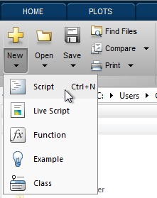

This tutorial shows you how to create and play a `Presentation`.

- [Step 1: Create a script](#step-1-create-a-script)
- [Step 2: Create a canvas](#step-2-create-a-canvas)
- [Step 3: Create a stimulus](#step-3-create-a-stimulus)
- [Step 4: Create a controller](#step-4-create-a-controller)
- [Step 5: Create a presentation](#step-5-create-a-presentation)
- [Step 6: Play the presentation](#step-6-play-the-presentation)

### Step 1: Create a script
Create a new script by selecting **New > Script** from the MATLAB toolstrip.



Save the script as "tutorial.m" anywhere on your machine.

### Step 2: Create a canvas
A `Canvas` represents an OpenGL context on which to draw visual stimuli. You must have a canvas in order to use Stage and you must have a window in order to create a canvas.

Start the "tutorial.m" script by opening a non-fullscreen, 640x480, window by calling the `stage.core.Window` constructor.

```matlab
% Open a window of size 640x480, non-fullscreen
window = stage.core.Window([640, 480], false);
```

Create a canvas on the window by calling the `stage.core.Canvas` constructor and passing it the window object.

```matlab
% Define a window of size 640x480, non-fullscreen
window = stage.core.Window([640, 480], false);
canvas = stage.core.Canvas(window);
```

<table cellspacing="0" class="note" summary="Note" cellpadding="5" border="1"><tbody><tr width="90%"><td>
<b>Note:</b> If you want to avoid typing the <code>stage.core.</code> prefix before <code>Window</code> and <code>Canvas</code> (and future Stage class constructors), you can add <code>import stage.core.*;</code> as the first line in your script and remove the prefix on subsequent lines.
</td></tr></tbody></table>

### Step 3: Create a stimulus
Create a 200x200 square stimulus at the center of the canvas by instantiating a `stage.builtin.stimuli.Rectangle` stimulus and setting its position and size properties appropriately.

```matlab
% Define a window of size 640x480, non-fullscreen
window = stage.core.Window([640, 480], false);
canvas = stage.core.Canvas(window);

% Create the 200x200 square stimulus at the center of the canvas
square = stage.builtin.stimuli.Rectangle();
square.position = [320, 240];
square.size = [200, 200];
```

### Step 4: Create a controller
In order to animate stimuli, you create controllers that modify properties (position, size, orientation, color, transparency, etc.) of stimuli as functions of playback state (e.g. time, frame, etc).

Create a controller to modify the orientation of the square stimulus to rotate it 180-degrees per second.

```matlab
% Define a window of size 640x480, non-fullscreen
window = stage.core.Window([640, 480], false);
canvas = stage.core.Canvas(window);

% Create the 200x200 square stimulus at the center of the canvas
square = stage.builtin.stimuli.Rectangle();
square.position = [320, 240];
square.size = [200, 200];

% Create a controller to change the square's orientation property as a function of time.
orientationController = stage.builtin.controllers.PropertyController(bar, 'orientation', ...
    @(state)state.time * 180);
```

### Step 5: Create a presentation
A `Presentation` simply serves to collect a set of stimuli and controllers into an experimental trial of given duration.

Create a 5 second presentation and add the square stimulus and orientation controller.

```matlab
% Define a window of size 640x480, non-fullscreen
window = stage.core.Window([640, 480], false);
canvas = stage.core.Canvas(window);

% Create the 200x200 square stimulus at the center of the canvas
square = stage.builtin.stimuli.Rectangle();
square.position = [320, 240];
square.size = [200, 200];

% Create a controller to change the square's orientation property as a function of time.
orientationController = stage.builtin.controllers.PropertyController(square, 'orientation', ...
    @(state)state.time * 180);

% Create a 5 second presentation.
presentation = stage.core.Presentation(5);
presentation.addStimulus(square);
presentation.addController(orientationController);
```

### Step 6: Play the presentation
Finally, play the presentation on the canvas.

```matlab
% Define a window of size 640x480, non-fullscreen
window = stage.core.Window([640, 480], false);
canvas = stage.core.Canvas(window);

% Create the 200x200 square stimulus at the center of the canvas
square = stage.builtin.stimuli.Rectangle();
square.position = [320, 240];
square.size = [200, 200];

% Create a controller to change the square's orientation property as a function of time.
orientationController = stage.builtin.controllers.PropertyController(square, 'orientation', ...
    @(state)state.time * 180);

% Create a 5 second presentation.
presentation = stage.core.Presentation(5);
presentation.addStimulus(square);
presentation.addController(orientationController);

% Play the presentation on the canvas!
presentation.play(canvas);
```

You should see a spinning square in the middle of the canvas that stops spinning after 5 seconds.

In order to close the window, you must clear all of the objects we created in the script by running `clear window canvas square orientationController presentation`, or `clear all` if you have nothing else of value in your workspace. In general however, you'll use the same window/canvas across many presentations.
