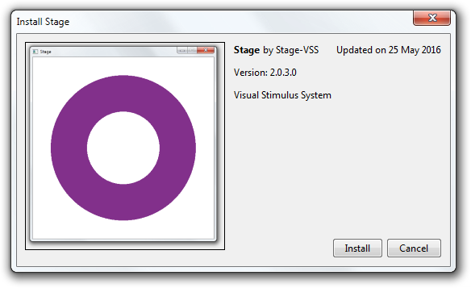

# Installation

### Step 1: Download the installer
Download the toolbox installer (.mltbx) from the [Stage releases page](https://github.com/Stage-VSS/stage/releases).

### Step 2: Install the toolbox into MATLAB
Double-click the downloaded toolbox installer. MATLAB will open and you will be prompted to install the toolbox.

