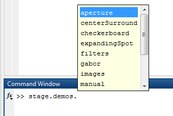
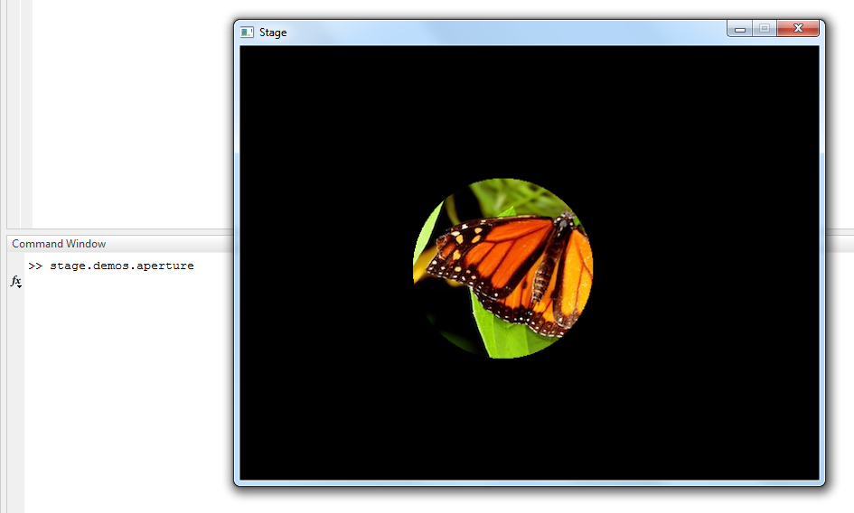
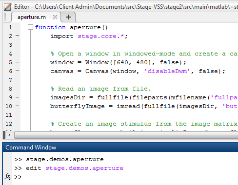

Stage includes a number of visual stimulus routines that demonstrate the capabilities of the toolbox.  It's often easiest to learn the system by simply running the demos and viewing the code.

This tutorial shows you how to run and view the code for the included Stage demos.

- [Step 1: Run a demo](#step-1-run-a-demo)
- [Step 2: View demo code](#step-2-view-demo-code)

### Step 1: Run a demo
When the Stage toolbox is installed, the `stage` package is added to your MATLAB search path. All Stage demos are located in `stage.demos`.

Enter `stage.demos.` at the MATLAB command window and hit tab to display a list of included demos.

Run the `stage.demos.aperture` by hitting enter to select it from the tab-completion list and enter again to run it from the command window.

When the aperture demo completes, the Stage window closes.

### Step 2: View demo code
To view any demo code, simply type "edit" before its full name in the MATLAB command window.

View the `stage.demos.aperture` code by typing `edit stage.demos.aperture` at the command window and pressing enter.

